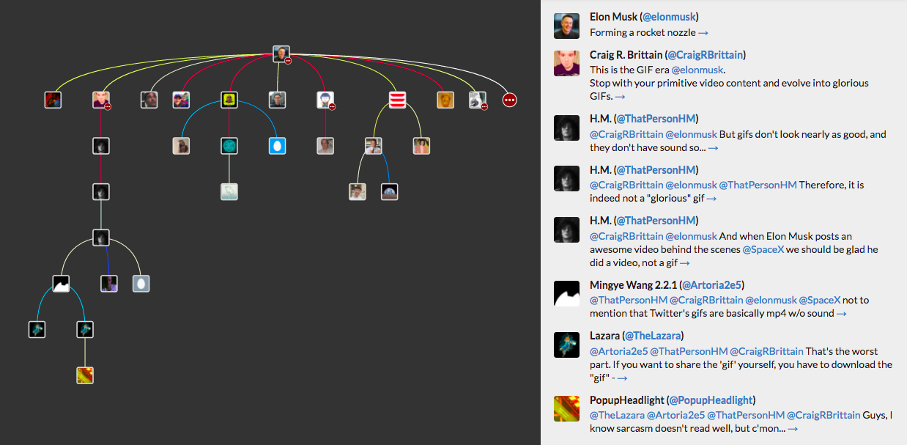
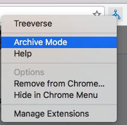

Treeverse
=========

Treeverse is a browser extension for navigating burgeoning Twitter conversations.

Conversations are visualized as a tree. Each node (square) is an individual tweet, and
an edge (line) between two tweets indicates that the lower one is a reply to the upper
one. The color of the line indicates the time duration between the two tweets
(red is faster, blue is slower.)

As you hover over nodes, the reply-chain preceeding that tweet appears on the right-side
pane. By clicking a node, you can freeze the UI on that tweet in order to interact with
the right-side pane. By clicking anywhere in the tree window, you can un-freeze the tweet
and return to the normal hover behavior.

Some tweets will appear with a red circle with white ellipses inside them, either overlayed
on them or as a separate node. This means that
there are more replies to that tweet that haven't been loaded. Double-clicking a node will
load additional replies to that tweet.

Installation
------------

Install from the [Chrome App Store](https://chrome.google.com/webstore/detail/treeverse/aahmjdadniahaicebomlagekkcnlcila).

Archive Mode
------------

In addition to visualizing conversations directly from Twitter, Treeverse supports loading
[twarc](https://github.com/DocNow/twarc) conversation archive files. First open Treeverse
in Archive Mode by right-clicking the Treeverse icon and selecting Archive Mode in the
drop-down.

In Archive Mode, Treeverse has a "drop zone" for dragging twarc .json ouput files to.
Simply drag the file into the drop zone to load the conversation.

Treeverse only supports output from the `twarc replies --recursive` command. For example:

    twarc replies 824077910927691778 --recursive > replies.json

Developing
----------

See [DEVELOPING.md](DEVELOPING.md)

Bugs & Contact
--------------

Tweet [@paulgb](https://twitter.com/paulgb) or report on GitHub.

Credits
-------

Icon created by [Eli Schiff](http://www.elischiff.com/).

Treeverse would not be possible without the excellent [d3.js](https://d3js.org/).
Styling is powered by [Semantic UI](http://semantic-ui.com/). 
