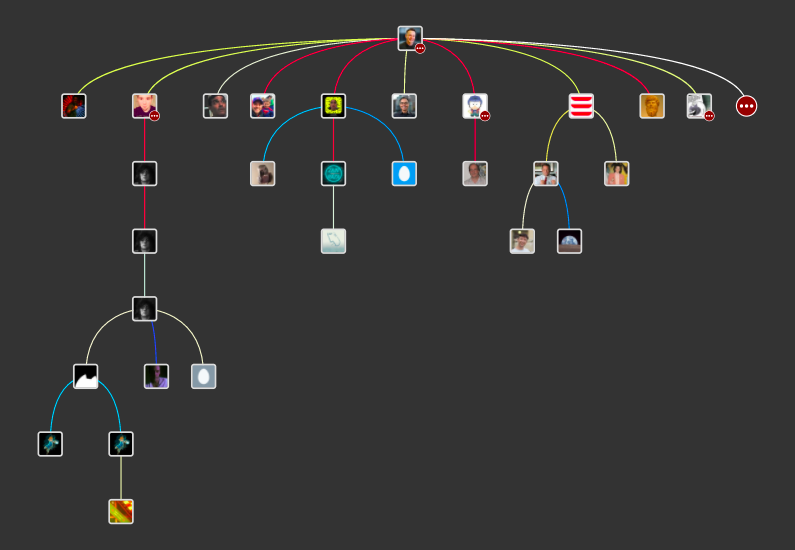

Treeverse
=========

Treeverse is a browser extension for navigating burgeoning Twitter conversations.

Conversations are visualized as a tree. Each node (square) is an individual tweet, and
an edge (line) between two tweets indicates that the lower one is a reply to the upper
one.

As you hover over nodes, the reply-chain preceeding that tweet appears on the right-side
pane. By clicking a node, you can freeze the UI on that tweet in order to interact with
the right-side pane. By clicking anywhere in the tree window, you can un-freeze the tweet
and return to the normal hover behavior.

Some tweets will appear with a red circle with white ellipses inside them. This means that
there are more replies to that tweet that haven't been loaded. Double-clicking a node will
load additional replies to that tweet.

Installation
------------

(Placeholder for Chrome app store instructions)

Bugs & Contact
--------------

Tweet [@paulgb](https://twitter.com/paulgb) or report on GitHub.

Credits
-------

Treeverse would not be possible without the excellent [d3.js](https://d3js.org/).
Styling is powered by [Semantic UI](http://semantic-ui.com/). 